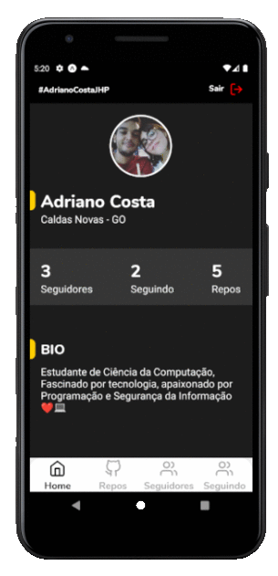

<h1 align = "center">
<br>
  
<br>
<br>
Desafio Luby Software
<p align = "center">
  
  
  
  
</p>
</h1>
<h4 align="center">
  <p align = "center">Desafio de programação para desenvolver uma <a href="https://xd.adobe.com/view/1798f30c-7746-444c-bffa-91b29835eef5-42cb/">aplicação</a> mobile com autenticação com o GitHub :iphone:<p/> 
</h4>

<p align="center">
  
  
</p>


## :rocket: Tecnologias
Este projeto foi desenvolvido com as seguintes tecnologias:

-  [Expo](https://expo.io/)
-  [React-Native](https://facebook.github.io/react-native/)
-  [React Native Gesture Handler](https://kmagiera.github.io/react-native-gesture-handler/)
-  [React Navigation](https://reactnavigation.org/)
-  [styled-components](https://www.styled-components.com/)
-  [@expo/vector-icons](https://expo.github.io/vector-icons/)

## :information_source: Como usar

Para clonar e executar este aplicativo, você precisará do Git e o Expo vs3.23.3 ou maior instalado em seu computador. Na linha de comando:

```bash
# Clone this repository
$ git clone https://github.com/AdrianoCostaJHP/Desafio-Luby-Software.git

# Go into the repository
$ cd Desafio-Luby-Software

# Install dependencies
$ expo install

# Run the app 
$ expo start
```

## :memo: Licença
Este projeto esta sob a licença do MIT.

---

Feito por ♥ por Adriano Costa :wave: [Entrar em contato!](https://www.linkedin.com/in/adriano-costa-101395141/)
